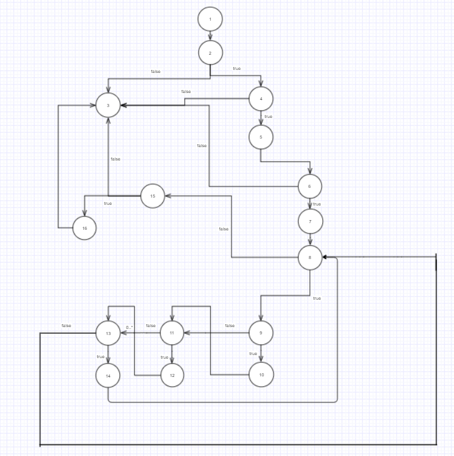

# Втора лабораториска вежба по Софтверско инженерство

## Филип Таневски, бр. на индекс 173165

### Група на код:

Групата што ја добив е 4

### Control Flow Graph

### Цикломатска комплексност

Цикломатската комплексност ја пресметав со формулата P+1 каде P ни се предикатните nodes, па според тоа имаме P = 8, и добиваме цикломатска комплексност од 8 + 1 = 9. Според другата формула имаме 23 ребра, 16 темиња, па според формулата се добива 23-16+2 што е истотака 9.

### Тест случаи според Multiple Condition критериумот

Со користењето на овој критериум потребно е да се евалуираат сите if statements кои имаат логички оператори кои ги имаме во функцијата и да ги провериме сите можни комбинации и исходи кои би ги имале од тие комбинации.

<b>Прв if statement со повеќе услови е:</b>

if (user.getUsername()!=null && user.getPassword()!=null) што ми е обележан со //4.

Логичкиот оператор овде е and (&&) што би значело дека има максимум 3 комбинации, и тоа:

TT со што изразот би бил точен.

TF со што изразот не е точен.

FX со што изразот не е точен а тука истотака имаме Lazy Evaluation заради фактот што ако првиот услов е false, нема потреба да се проверува вистинитоста на другиот услов бидејќи изразот ќе биде неточен.

Прв случај: Ако user.getUsername() има вредност "Tanevski" а user.getPassword() има вредност null тогаш овој if нема да помине (TF).

Втор случај: Ако user.getUsername() има вредност null тогаш без разлика дали другиот услов има вредност или не, овој if нема да помине(FX).

Трет случај: Ако user.getUsername() има вредност "Tanevski" а user.getPassword() има вредност "Filip" тогаш if-от поминува, и можеме да преминеме на вториот if.

________________________________________________________________________________________________________________________________________
<b>Втор if statement со повеќе услови е:</b>

if (!passwordLower.contains(user.getUsername().toLowerCase()) && password.length()>=8) што ми е обележан со //6.

Логичкиот оператор овде е and (&&) што би значело дека има максимум 3 комбинации, и тоа:

TT со што изразот би бил точен.

TF со што изразот не е точен.

FX со што изразот не е точен а тука истотака имаме Lazy Evaluation заради фактот што ако првиот услов е false, нема потреба да се проверува вистинитоста на другиот услов бидејќи изразот ќе биде неточен.

Прв случај: Нека Username е "Tanevski" а password e "Filip", со ова ќе се исполни првиот услов дека корисничкото име и лозинката не се исти меѓутоа нема да се исполни условот за должината на лозинката па затоа нема да помине ова. (TF)

Втор случај: Нека Username e "Filip" а password e "Tanfilipevski", тука бидејќи првиот услов нема да е исполнет повторно имаме Lazy Evaluation и ова нема да помине(FX) 

Трет случај: Нека Username е "Filip" a password e "Tanevski" тогаш if-от поминува.

________________________________________________________________________________________________________________________________________Трет if statement со повеќе логички оператори

if (digit && upper && special) обележан со //15.

Логичкиот оператор овде е and (&&) што би значело дека има максимум 4 комбинации, и тоа:

TTT со што изразот би бил точен.

TTF со што изразот не би бил точен.

TFX со што изразот не би бил точен. (Lazy Evaluation)

FXX со што изразот не би бил точен. (Lazy Evaluation)

Прв случај: Ако user.getPassword() врати "tanevski" тогаш нема да помине овој if бидејќи не е исполнет условот за бројка во лозинката. Тука имаме lazy evaluation.
Втор случај: Ако user.getPassword() врати "tanevski1" тогаш ќе помине првиот услов, меѓутоа нема да помине вториот (upper) и автоматски нема да помине if-от. Тука имаме lazy evaluation.

Трет случај: Ако user.getPassword() врати "Tanevski1" тогаш првите два услови за бројка и голема буква ќе поминат меѓутоа нема да помине последниот услов (special) па затоа нема да помине ни if-от.

Четврт случај: Ако user.getPassword() врати "Tanevski1!"поминат сите три услови (digit && upper && special) тоа значи дека овој if ќе помине.

### Тест случаи според Every Path критериумот

Возможни патеки се:

1) 1,2,3.

2) 1,2,4,3

3) 1,2,4,5,6,3

4) 1,2,4,5,6,7,8,15,3

5) 1,2,4,5,6,7,8,15,16,3

6) 1,2,4,5,6,7,8,9,11,13,8,15,3

7) 1,2,4,5,6,7,8,9,11,13,8,15,16,3

8) 1,2,4,5,6,7,8,9,10,11,13,8,15,3

9) 1,2,4,5,6,7,8,9,10,11,13,8,15,16,3

10) 1,2,4,5,6,7,8,9,10,11,12,13,8,15,3

11) 1,2,4,5,6,7,8,9,10,11,12,13,8,15,16,3

12) 1,2,4,5,6,7,8,9,10,11,12,13,14,8,15,3

13) 1,2,4,5,6,7,8,9,10,11,12,13,14,8,15,16,3
